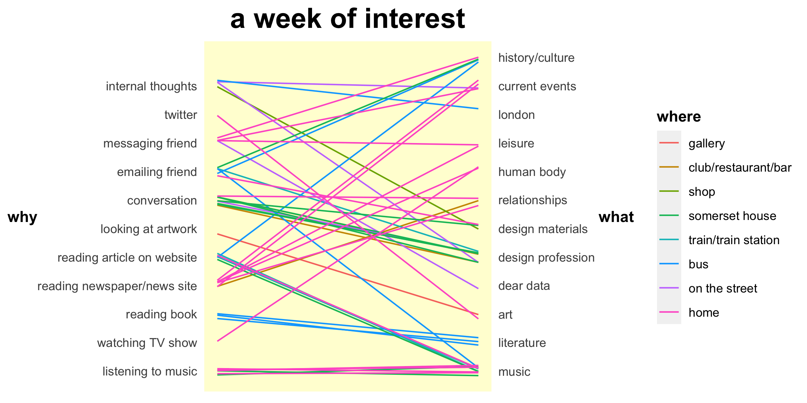

```{r setup, include=FALSE}
rm(list = ls()) # clear global environ

knitr::opts_chunk$set(echo = TRUE, cache = TRUE)

# set working directory
setwd("~/Desktop/Yale/Senior/1 DataViz/summary/compiled")

# load libraries
library(ggmosaic)
library(ggforce)
library(ggthemes)
library(gridExtra)
library(gganimate)
library(gifski)
library(gapminder)
library(tidyverse)
```

## Course Summary

Theory, history, and practice of visualization of social and political data by hand and using the ggplot2 package in tidyverse in R. Study and critique of data visualization best practices, such as Anscombe's quartet, minimalism, data-ink ratio maximization, ducks, the lie factor, and small multiples. Focus on thoughtful and honest presentation of data and the perception of graphs in a social context.

## Key Skills

* **Best practices in data visualization**: emphasis on including both the raw data and the summary statistics to show what we know and why we think we know it

* **Data density**: conveying the most information with the least amount of ink

* **Style imitation**: mimicking and redesigning famous art pieces and data visualizations

* **ggplot2 in R**: sunburst plots, spaghetti plots, tree maps, geographical maps, networks, scatter plots, bar plots, box plots, faceted graphs, etc.

* **Empirical validation of theoretical claims of visualization**: design and analysis of a A/B graph perception experiment

## Code Samples

The below assignments revolved around imitating the style of an artist / data visualist. I reflected upon what I liked and disliked about the visualization, recreated or redesigned the original in ggplot2, and made a homage in the style of the original. The combination of drawing by hand and using ggplot2 made me more intentional with my visualizations, questioning the default ggplot2 settings I used to rely on.

### Sol LeWitt (1928-2007) ###

```{r echo=FALSE, out.width = "70%"}
knitr::include_graphics("lewitt/plots/lewitt_redesign_animated.gif")
```

A redesign and homage in the minimalist style of Sol LeWitt's wall drawings. These wall drawings are unique in that they are not done by the artist himself but are instead constructed temporarily on-site by curators following a set of his instructions. LeWitt argued that the idea for artwork matters more than its form.

The instructions are open to interpretation. For instance, in the instructions for [Wall Drawing 118](https://observer.com/2012/10/here-are-the-instructions-for-sol-lewitts-1971-wall-drawing-for-the-school-of-the-mfa-boston/), he calls for random points evenly distributed over the area of the wall - "random" and "evenly distributed" call for two different placement processes, more easily handled by a human than a computer.

<details>
  <summary>Redesign</summary>

**Original:**


[Wall Drawing 86](https://massmoca.org/event/walldrawing86/) at MASS MoCa in 2008

> "Ten thousand lines about 10 inches (25 cm) long, covering the wall "evenly."

**Implementation:**

```{r echo=FALSE}
knitr::include_graphics("lewitt/plots/lewitt_redesign_animated.gif")
```

The hard work here was the thought process behind the random lines (see the linear algebra below). The implementation in ggplot2 was straightforward after the data was in the desired format. I chose the colors from the original and adjusted the line size manually until it looked about the same. There is something R can do that the wall can’t—animate! I spent some time playing around with gganimate() to create a gif version, where each line is added in one-by-one. It is somewhat hypnotic and fun to look at.

**Thought process:**

In short, the procedure for creating the data is:

1)	Generate random $x_1$ and $y_1$
2)	Fix slope at an arbitrary value; choose $x_2$ and $y_2$ such that the distance from $x_1$ and $y_1$ is fixed
3)	Rotate $x_2$ and $y_2$ around $x_1$ and $y_1$ at random angles to simulate random slopes 

From Wall Drawing #86, we can obtain the width (~996 pixels) and the height (~664 pixels) of this portion of the wall, the amount of lines on this portion of the wall (~90), and the length of a line (~711 pixels). Note that the ratio between pixels and inches is 96:1.

The key issue with creating this plot is the fixed line length. LeWitt’s lines have different slopes but equal lengths. This means that ($x_1$, $y_1$) and ($x_2$, $y_2$) coordinates cannot be chosen randomly, independently of each other. The second set of coordinates must be constrained such that each line has the same length.

The distance of a line d is given by:

$$\begin{equation}
\tag{1}
d = \sqrt{(x_2-x_1)^2+(y_2-y_1)^2}
\end{equation}$$

Let $x_1$ and $y_1$ be selected at random within the confines of the grid. Using point-slope form:

$$\begin{equation}
\tag{2}
(y_2-y_1) = m(x_2-x_1)
\end{equation}$$

Plugging Eq. 2 into Eq. 1 and simplifying:

$$\begin{equation}
d = \sqrt{(1+m^2)(x_2-x_1)^2}
\end{equation}$$

Since $x_1$ is known and d can be determined from LeWitt's original ratio of line length to wall height, we solve for $x_2$:

$$\begin{equation}
\tag{3}
x_2 = x_1 + \sqrt{\frac{d^2}{1+m^2}}
\end{equation}$$

To solve for $y_2$, we plug in our result for $x_2$ into a modified version of Eq. 2:

$$\begin{equation}
\tag{4}
y_2 = m(x_2-x_1) + y_1
\end{equation}$$

Only m is unknown, which we can arbitrarily set to m=1. Now we have generated lines of the same length, with random start points, but with the same slope. We can employ linear algebra to rotate a vector in 2D space around the origin at a randomly chosen $\theta$ between 0 and $2 \pi$:

$$\begin{equation}
x' = xcos(\theta) - ysin(\theta)
y' = xsin(\theta) + ycos(\theta)
\end{equation}$$

Note that the above expressions rotate ($x_2$, $y_2$) around the origin, but we wish to rotate around ($x_1$, $y_1$) and therefore must change the coordinate system so that the point of rotation is the origin, then perform the rotation, and finally undo the translation:

$$\begin{equation}
\tag{5}
x_2' = (x_2-x_1)cos(\theta) - (y_2-y_1)sin(\theta) + x_1
\end{equation}$$

$$\begin{equation}
\tag{6}
y_2' = (x_2-x_1)sin(\theta) + (y_2-y_1)cos(\theta) + y_1
\end{equation}$$

Recall that $x_1$ and $y_1$ are selected randomly within the confines of the grid and that $\theta$ is chosen randomly between 0 and $2 \pi$. The key formulas that will be used in R to construct our data frame with columns $x_1$, $y_1$, $x_2$, $y_2$, $x_2'$, and $y_2'$ are Eq. 3 (to give $x_2$), Eq. 4 (to give $y_2$), Eq. 5 (to give $x_2'$), Eq. 6 (to give $y_2'$).

**Looking ahead:**

When side by side, the main difference I notice between mine and the original is texture - the lines in the original have some element of varying width/shakiness. In a future iteration, this could be addressed by constructing lines as a series of points, then jittering the points.

<details>
  <summary>Click for code</summary>

```{r}
n <- 90 # estimated # of lines on original

# set x and y ranges for graph

# dimensions of original in pixels
xrange <- c(0, 996)
yrange <- c(0, 664)

# dimensions of original converted to inches
xrange <- xrange / 96
yrange <- yrange / 96


# randomly choose starting coordinates of line within range
# randomly choose theta to rotate around (in radians)
# id for plotting later
lines <- tibble(
  x1 = runif(n, xrange[1], xrange[2]),
  y1 = runif(n, yrange[1], yrange[2]),
  theta = runif(n, 0, 2*pi),
  id = c(1:n)
)

# set slope to arbitrary value
m <- 1

# calculate distance ratio equivalent to lewitt's
d <- (711/96)*(yrange[2]-yrange[1])

# calculate point specified distance away
lines <- lines %>%
  mutate(x2 = x1 + sqrt((d^2)/(1+m^2)),
         y2 = m^2*(x2-x1) + y1)

# rotate around (x1, y1) to give new (x2f, y2f) so slope is random
lines <- lines %>%
  mutate(x2f = (x2-x1)*cos(theta) - (y2-y1)*sin(theta) + x1,
         y2f = (x2-x1)*sin(theta) + (y2-y1)*cos(theta) + y1)

## PLOT

# colors selected from original depiction
# line weight adjusted manually
lewitt <-
  ggplot(data = lines) +
  geom_segment(aes(x = x1, y = y1, xend = x2f, yend = y2f), colour = "#c5c6c4", size = .25) +
  coord_cartesian(xlim = xrange, ylim = yrange) +
  theme(axis.text = element_blank(),
        axis.title = element_blank(),
        axis.ticks = element_blank(),
        panel.background = element_rect(fill = "#efefeb"),
        panel.grid.major = element_blank(),
        panel.grid.minor = element_blank(),
        plot.margin = unit(c(0, 0, 0, 0), "null"),
        panel.border = element_blank())

ggsave("lewitt/plots/lewitt_redesign.png", lewitt, height = yrange[2], width = xrange[2])

# animate
anim <-
  ggplot(data = lines, aes(group = id)) +
  geom_segment(aes(x = x1, y = y1, xend = x2f, yend = y2f), colour = "black", size = .25) +
  coord_cartesian(xlim = xrange, ylim = yrange) +
  theme(axis.text = element_blank(),
        axis.title = element_blank(),
        axis.ticks = element_blank(),
        panel.background = element_rect(fill = "#f3f3f3"),
        panel.grid.major = element_blank(),
        panel.grid.minor = element_blank(),
        plot.margin = unit(c(0, 0, 0, 0), "null"),
        panel.border = element_blank()) + 
  transition_time(id)+
  shadow_mark(color="#c5c6c4")

animate(anim, duration = 5, fps = 20, width = xrange[2]*96, height = yrange[2]*96, renderer = gifski_renderer())
anim_save("lewitt/plots/lewitt_redesign_animated.gif")
```

</details>
</details>

<details>
  <summary>Homage</summary>
  
**Instructions:**

Inspired by the concept that certain atoms form certain numbers of bonds as determined by their valence electrons and by the 4 elements that are the major components of organic compounds:

> “On a grey wall surface, using 4 colored pencils, place 22 points at random. The points should be evenly distributed over the area of the wall. Grey points must have 1 connecting line. Red points must have 2 connecting lines. Blue points must have 3 connecting lines. Black points must have 4 connecting lines. If necessary, you may add an extra grey point so that all points have the correct number of connections.”

All elements are depicted using approximations of their traditional space-filling model colors (grey, instead of the classic white, for hydrogen, black for carbon, sky blue for nitrogen, red for oxygen).

**Realization**

{width=70%}

This is a difficult visualization problem because of the different number of connections allowed for each element. Chemistry is complicated! I placed points pseudo-randomly (I eyeballed it).  For connection, my overall strategy was to start with the carbons and make sure they all had 4 connections, then complete the nitrogens, then the oxygens, then the hydrogens. I ended up having to add one more hydrogen so that all elements would have the proper number of connections. Interestingly, the structure does look somewhat similar to something you'd find in nature, with a carbon backbone and amine and alcohol groups sticking off.

**Looking ahead:**

After completing my instructions by hand myself and having to erase occasionally, I’m interested in ways this could be implemented on a computer. I can think of a way to start:

1)	Start with the carbon closest to the middle
2)	Connect carbon n to its 4 nearest neighbors
3)	Assess the identities of these n+1 elements. If hydrogen, stop. If oxygen, connect to neighbor. If nitrogen, connect to 2 neighbors.

The issue is how these neighbors would be determined. I could imagine moving outwards in a radial sense to form connections.

It would also be interesting to include the relative abundance of the elements and the ability of elements to double and triple bond. Perhaps a computer could reach the same conclusions as nature for the building blocks of life.

</details>

### W.E.B. Du Bois (1868-1963) ###

{width=60%}

{width=60%}

A redesign and homage in the vibrant style of W.E.B. Du Bois, a sociologist, author, activist, and a trailblazer in data visualization. As the organizer of The Exhibit of American Negroes at the 1900 World's Fair in Paris, he created about 60 infographics about Black socioeconomic status, education, population growth, and more to show the lasting impact of slavery in the United States. Instead of using traditional graphs, Du Bois used  bold, and creative designs, allowing his "infographic activism" to reach outside of academia.

<details>
  <summary>Redesign</summary>
  
**Original:**

{width=40%}

Source: [The Library of Congress](https://www.loc.gov/pictures/collection/anedub/item/2013650435/)

**Goal:**

Du Bois’s graph is striking and simple - perhaps too simple. At first glance, I thought all of the circles were the same size and assumed that each circle represented 1 year. However, this is not the case; the last circle is larger than the first circle, and the spacing in time is inconsistent. I redesign the data in the style of a time series to make the numeric values over time easier to interpret.

**Implementation:**


For my visualization, I chose to keep the essence of Du Bois’s original visualization (the background, the circular design) but added a different color scheme, spaced out the circles by year and flipped the graph horizontally to make it clearer that time is passing, and added a dashed line to show the difference in size between the first circle and the second circle. I hope that my visualization, in the style of a time series, makes it more clear that time is passing and also helps to highlight the trend of increasing Black teachers in Georgia public schools.

<details>
  <summary>Click for code</summary>

```{r}
# read data
teach <- read.csv("dubois/data/blackteachers_GApublicschools.csv")

# create x-coordinates to map to; convert year to factor
teach <- teach %>% 
  mutate(x_adj = min(year) + (year-min(year))*max(black_teachers)*2,
         year = as.factor(year))

## PLOT

circle_plot <-
  ggplot(teach) +
  geom_circle(aes(x0 = x_adj, y0 = 1, r = black_teachers, fill = year),
              color = "#5e5b5b") +
  # top line
  geom_segment(aes(x = min(x_adj) - min(black_teachers),
                   y = min(black_teachers),
                   xend = max(x_adj) + max(black_teachers),
                   yend = max(black_teachers)),
               color = "#5c1b13", linetype = 12) +
  # bottom line
  geom_segment(aes(x = min(x_adj) - min(black_teachers),
                   y = -min(black_teachers),
                   xend = max(x_adj) + max(black_teachers),
                   yend = -max(black_teachers)),
               color = "#5c1b13", linetype = 12) +
  labs(title = "BLACK TEACHERS IN GEORGIA PUBLIC SCHOOLS",
       caption = "Source: W.E.B. Du Bois's Data Portraits: Visualizing Black America") +
  coord_fixed() +
  geom_text(aes(x = x_adj+9400, y = 0, label = black_teachers),
            hjust = 4, color = "white", size = 2.5) +
  geom_text(aes(x = x_adj+9400, y = -4500, label = year),
            hjust = 4, color = "black", size = 2.5) +
  scale_fill_brewer(palette = "RdGy") +
  coord_cartesian(clip = "off") +
  theme(
    text = element_text(size = 10),
    legend.position = "none",
    axis.title.x = element_blank(),
    axis.text.x = element_blank(),
    axis.text.y = element_blank(),
    axis.title.y = element_blank(),
    axis.ticks.x = element_blank(),
    axis.ticks.y.left = element_blank(),
    axis.ticks.y.right = element_blank(),
    panel.background = element_blank(),
    panel.border = element_blank(),
    panel.grid.major = element_blank(),
    panel.grid.minor = element_blank(),
    plot.title = element_text(size = 11, face = "bold"),
    plot.background = element_rect(fill = "#F0E6D2",
                                   color = NA),
    plot.margin = margin(t = 20, r = 20, b = 10, l = 20))

ggsave("dubois/plots/dubois_redesign.png", circle_plot, width = 7, height = 1.5)
```

</details>
</details>

<details>
  <summary>Homage</summary>
  
**Original:**

{width=40%}

Source: [The Library of Congress](https://www.loc.gov/item/2013650445/)

**Goal:**

To create a contemporary version of Du Bois's graph, I use ggplot2 and an updated dataset. Du Bois's graph depicts the assessed value of household and kitchen furniture owned by black people in Georgia from 1875-1899. For my contemporary version, I chose a similar (though broader) dataset: the [median household incomes for Americans](https://data.diversitydatakids.org/dataset/19013_1_d-median-household-income--dollar--by-race-ethnicity/resource/f1a2ca2d-5e40-4ca8-8a4f-110ddc2de73f), segmented by race, as recorded by the U.S. Census at 9 separate intervals from 2005-2017.

**Implementation:**

{width=70%}

Instead of showing absolute numbers, I chose to show relative numbers: Black household income as a percentage of average household income. To make the percentages easier to interpret, I use a circular bar plot instead of a classic Du Bois spiral. The line at 66% emphasizes that Black Americans only 66% of the overall U.S. median average, without much fluctuation around this number in the past decade. I think this transformation speaks to Du Bois's core concept - the legacy of slavery and how Black Americans still lag behind financially due to systemic oppression.

<details>
  <summary>Click for code</summary>

```{r}
## DATA

income <- read.csv("dubois/data/UScensus_medianhouseholdincome_dollars_byrace.csv")

# black income as % of overall average

income <- income %>%
  mutate(black_pct = (black_est / total_est)*100,
         year = factor(year))

## PLOT

# colors inspired by book
db_colors <- c("#B4A096", "#eaafa6", "#9da0b0", "#b09576", "#c4a58f",
               "#ecb025", "#dc354a", "#281E5A", "#965555")

db_plot <-
  ggplot(income, aes(x = year, y = black_pct,
                               fill = year)) + 
  geom_bar(width = 0.9, stat="identity", fill = db_colors) + 
  geom_hline(yintercept = 66) +
  coord_polar(theta = "y") +
  xlab("") + ylab("") +
  ylim(c(0,100)) +
  labs(title = "MEDIAN HOUSEHOLD INCOME FOR BLACK AMERICANS",
       subtitle = "as % of overall U.S. median household income",
       caption = "Source: U.S. Census") +
  geom_text(aes(x = year, y = 0, label = year), hjust = 1.8, color = db_colors) +
  geom_text(aes(x = year, y = 0, 
                label = paste("...$", substr(round(black_est, -3), 1, 2), "k", sep = "")),
            hjust = 1.1) +
  geom_text(x = 0, y = 0, label = "66%", hjust = 8, vjust = 8) +
  theme_minimal() +
  theme(legend.position = "none",
        panel.grid.major = element_blank(),
        panel.grid.minor = element_blank(),
        axis.line = element_blank(),
        axis.text.y = element_blank(),
        axis.text.x = element_blank(),
        axis.ticks = element_blank(),
        plot.background = element_rect(fill = "#F0E6D2",
                                       color = NA),
        plot.margin = margin(t = 20, r = 40, b = 10, l = 40),
        plot.title = element_text(face = "bold", size = 12))

ggsave("dubois/plots/dubois_homage.png", db_plot, height = 8, width = 8)
```
  
</details>

</details>

### Dear Data (2016) ###

{width=45%}{width=45%}
{width=45%} {width=45%}

A redesign and recreation of one week of Giorgia Lupi and Stefanie Posavec's year-long data drawing project [Dear Data](http://www.dear-data.com/theproject). Each week, the two collected detailed data about a specific topic in their lives, such as complaints, laughs, or goodbyes, and visualized the data on postcards they sent to each other.

<details>
  <summary>Redesign</summary>

**Goal:**

To capture the high-dimensional, low n data that describes what Stephanie found interesting over the course of a week: what she was interested in, why she became interested, and where she was. There is a tension between summarizing the data into an easily digestible form and maintaining the complexity of the original.

**Data source:**

Stefanie Posavec's [Week 20: A week of interesting things](http://www.dear-data.com/by-week#/week-20-a-week-of-interesting-things/)

{width=45%} {width=45%}

**First Attempt:**

{width=70%}

In my first attempt, I was overwhelmed by the dimensionality of Stephanie's data and sought to simplify it. There are a lot of things that inspire Stephanie, in a lot of places. But many categories only have 1 or 2 data points. I decided to consolidate the categories of where she was inspired and what inspired her. The consolidation makes it easier to see broader trends, though does eliminate some of the nuances that may have meant something special to Stephanie.

I reordered the why and where variables according to the number of things in the category and used these ordered categories to make a mosaic plot. Note there is one dimension missing in this plot: what Stephanie was inspired about. There are 12 different things that Stephanie was inspired about, and these were difficult to combine, difficult to visualize, and frankly difficult to understand as somebody who is not Stephanie. Much more relatable are the ideas of why and where inspiration happens. I find the data about what causes inspiration more revealing than what a person is inspired about. Stripping away the details makes Stephanie’s life more applicable to one’s own.

> In simplicity, we find a story.

Stephanie is inspired by the world around her (particularly the people who surround her) and finds bits of inspiration primarily at home and at work and more often than you’d think on transport.

**Second Attempt:**

{width=70%}

Noting the loss of dimensionality in the previous attempt, I chose to make a second version including all of the data - why, what, and where, with all of the categories in all of their full complexity. This plot is admittedly harder to read but more true to the data. The only modification from Stephanie's original coding is the ordering of the factors, which I tried to do such that similar things were next to each other.

> This plot lets the data speak for itself, without any of my ideas imposed.

The spaghetti plot connects causes of interest to what Stephanie was interested in, colored by where she was interested. The lowercase is intentional; I think it gives more of the handwritten vibe of the original. The jittering in the plot reveals that there are a few connections that are more common than others - we see listening to music and conversation as big causes of interest, with listening to music often leading to interest in music (no surprise there) and with conversation often leading to interest in the design profession (no surprise there given most of these conversations happen at Somerset House, Stephanie’s workplace). 

<details>
  <summary>Click for code</summary>

```{r}
original <- read.csv("dear_data/data/stephanie_data.csv") # week 20 by sp

dd <- original # df that will be modified

## ATTEMPT 1: simplistic mosaic plot

# DATA CLEANING

# new concise categories for "why"

media <- c("watching TV show", "twitter", "reading newspaper/news site", "reading article on website")

art <- c("reading book", "looking at artwork", "listening to music")

others <- c("messaging friend", "emailing friend", "conversation")

self <- c("internal thoughts")

# new concise categories for "where"

transport <- c("bus", "train/train station", "on the street")

venue <- c("club/restaurant/bar", "shop", "gallery")

work <- c("somerset house")

home <- c("home")

# apply categories to df

dd <- dd %>%
  mutate(why = case_when(
    why %in% media ~ "media",
    why %in% art ~ "art",
    why %in% others ~ "others",
    why %in% self ~ "self")) %>%
  mutate(where = case_when(
    where %in% transport ~ "transport",
    where %in% venue ~ "venue",
    where %in% work ~ "work",
    where %in% home ~ "home"
  ))

# sort factors by frequency
dd <- dd %>%
  mutate(interest = factor(interest, levels = names(sort(table(dd$interest)))),
         why = factor(why, levels = names(sort(table(dd$why)))),
         where = factor(where, levels = names(sort(table(dd$where)))))

# MOSAIC PLOT

p_mosaic <- ggplot(dd) +
  geom_mosaic(aes(x = product(where, why), fill = where)) +
  labs(title = "where i was inspired",
       x = "what inspired me",
       fill = "where i was inspired") +
  annotate("text", x = 0.8, y = 0.85, label = "home", family = "mono") +
  annotate("text", x = 0.8, y = 0.6, label = "transport", family = "mono") +
  annotate("text", x = 0.8, y = 0.28, label = "work", family = "mono") +
  annotate("text", x = 0.8, y = 0.05, label = "venue", family = "mono") +
  theme(
    legend.position = "none",
    text = element_text(family = "mono"),
    axis.text.y = element_blank(),
    axis.ticks.y = element_blank(),
    axis.title.y = element_blank(),
    panel.background = element_blank(),
    panel.border = element_blank(),
    panel.grid.major = element_blank(),
    panel.grid.minor = element_blank(),
    plot.background = element_blank(),
    plot.title = element_text(size = 20, face = "bold"))

ggsave("dear_data/plots/dd_mosaic.png", p_mosaic, height=4, width=8)

## ATTEMPT 2: spaghetti plot (i.e. bipartite graph / parallel coordinate plot)

# DATA CLEANING

# vectors for factor levels
interest_ordered <- c("music", "literature", "art", "dear data", "design profession",
                      "design materials", "relationships", "human body", "leisure",
                      "london", "current events", "history/culture")

why_ordered <- c("listening to music", "watching TV show", "reading book",
                 "reading newspaper/news site", "reading article on website",
                 "looking at artwork", "conversation", "emailing friend",
                 "messaging friend", "twitter", "internal thoughts")
  
where_ordered <- c("gallery", "club/restaurant/bar", "shop", "somerset house",
                   "train/train station", "bus", "on the street", "home")

# change to factors
dd_f <- original %>%
  mutate(interest = factor(interest,
                           levels = interest_ordered),
         why = factor(why,
                       levels = why_ordered),
         where = factor(where,
                           levels = where_ordered))

# change to numeric for geom_segment
dd_bp <- dd_f %>%
  mutate(interest = as.numeric(interest),
         why = as.numeric(why))

# PLOT

# basic plot
p_bp <- ggplot(dd_bp, aes(color = where)) +
  geom_segment(aes(x = 0, xend = 1, y = jitter(why), yend = jitter(interest))) +
  labs(title = "a week of interest") +
  scale_y_continuous(name = "why",
                     breaks = c(1:11),
                     labels = why_ordered,
                     sec.axis = sec_axis(~.*1, name = "what",
                                         breaks = c(1:12),
                                         labels = interest_ordered))

# cleaned plot
p_bp_clean <- p_bp +
  theme(
    axis.title.x = element_blank(),
    axis.title.y.right = element_text(angle = 360, vjust = 0.5, face = "bold"),
    axis.title.y.left = element_text(angle = 360, face = "bold"),
    axis.text.x = element_blank(),
    axis.title.y = element_blank(),
    axis.ticks.x = element_blank(),
    axis.ticks.y.left = element_blank(),
    axis.ticks.y.right = element_blank(),
    legend.title = element_text(face = "bold"),
    panel.background = element_rect(fill = "#fffdd6"),
    panel.border = element_blank(),
    panel.grid.major = element_blank(),
    panel.grid.minor = element_blank(),
    plot.title = element_text(size = 20, face = "bold", hjust = 0.5))

ggsave("dear_data/plots/dd_spaghetti.png", p_bp_clean, height=4, width=8)
```

</details>
</details>

<details>
  <summary>Homage</summary>

{width=45%} {width=45%}

**Goal:**

For one week, I tracked my schedule. I included where I was, what I was doing, and how I was feeling. I noticed that my mood was often connected to spontaneous run-ins with friends, unexpected phone calls, or meeting new people - bits of unexpected happy social interactions throughout the day - so I decided to track these occurrences as well to see where and when they were happening. In the style of Dear Data, I also chose to star my events spent with my correspondent, Chelsea. I hoped this visualization would help me answer the question of where does all my time go - and, more importantly, the question of where it should be going based on what sparks joy.

**Implementation:**

For my visualization, I was inspired by the lines and colors in Dear Data. The 7 horizontal lines represent the 7 days of the week, with the horizontal axis spanning from 1am to 12pm each day. The type of line indicates the activity, while the color indicates the location. The black annotations indicate unexpected social encounters: a plus sign is an unexpected phone call, a squiggle is an unexpected run-in, an exclamation mark is meeting a new person. The smiley faces indicate the daily highs and lows.

**Reflection:**

I note that I spent a lot of time outdoors, a lot of time with friends, and often interact with more people than expected. I note that my daily highs tend to be close to these unexpected social interactions.

> Spontaneous encounters are still new to me this semester, after over a year of scheduled Zoom calls and only planned interactions.

I wonder for how long casual run-ins will continue to be something beautiful and novel.

</details>

### The Women's Table (1989)

{width=45%} {width=45%}

A reflection on, redesign of, and homage to Maya Lin's *Women's Table*, a sculpture installed outside Sterling Memorial Library at Yale University in 1989 to commemorate the 20th anniversary of coeducation in Yale College.

<details>
  <summary>Reflection</summary>
  
{width=50%}

The *Women’s Table* is a granite sculpture in the shape of a table with a rectangular base and elliptical top. Water bubbles up from the center of the table and overflows over the sides of the table to a collection beneath. Into the granite is engraved a spiral of 157 numbers in old-fashioned-looking text representing the number of women at Yale in that year. In the center of the table, these numbers are all 0’s, but they slowly start to increase into the dozens, hundreds, thousands as the numbers spiral out from the center. Every 10 years from 1870 to 1990, there is a marker of the year; years 1837 to 1993 are represented overall. There is a star on 1969 indicating co-education in Yale College.

When looking at the *Women’s Table*, the first thing that strikes is how long it took for there to be a substantial number of women at Yale. There are 96 zeroes in the center of the table, tightly spiraling towards the center in a way that feels like it stretches even further back at time. As the number of women increases, the spiral grows slowly; indeed, it takes 168 years for the number of women to exceed 100, and 193 years for the number of women to exceed 1,000. The spiral reminds the viewer that change is not linear. The spiral also feels unfinished with blank space left on the table, emphasizing that there is still more work to be done.

In terms of critiques, I will say the numbers on the table are difficult to read, there is no perspective on the ratio between men and women, and the spiral is hard to interpret. When I graph the data very simply in R, I am able to note a large increase in the rate of women admitted after 1960 that I was not able to see on the table itself. The table gives an idea of the increase, but it’s hard to interpret the magnitude and what it means in context of the total attendance of the university.

</details>

<details>
  <summary>Redesign</summary>
  
{width=90%}

**Goal:**

Noting the lack of context on the *Women’s Table* and the difficulty in interpreting magnitude, I chose to both collect more data and redesign the data visualization using tidyverse. Instead of a spiral, I chose a time series. Here, the passage of time is more concrete than in the spiral, and it is easier for the viewer to interpret magnitude of changes.

**Data source:**

Most of the data is transcribed from "A Yale Book of Numbers." The [1701-1976](https://oir.yale.edu/sites/default/files/pierson_1701-1976.pdf) version contains information on total enrollment starting on page 3 (though, for 1701-1812, only Yale College min. estim. is provided). The [1976-1999](https://oir.yale.edu/sites/default/files/pierson_update_1976-2000.pdf) version contains information on total enrollment in Table A-1 and women enrollment in Table-A7. The most recent data (2000-2020) is sourced from the dataframe provided in PLSC 349 section. The data about the year when various Yale schools started accepting women is [here](https://celebratewomen.yale.edu/history/timeline-women-yale).

**Implementation:**

The top section of the plot provides the necessary context for the numbers Lin shows - the total enrollment at Yale puts the number of women at Yale in perspective as the viewer can see the gap. For further perspective, I also included the percentage of women enrolled in the lower section of the plot. Now, it is strikingly clear that the female percentage is well below 50% for years and only begins to approach over 40% in the 1970s. It eventually surpasses 50% in 2004. For further context, I also included when Yale schools began accepting women, beginning with the school of Fine Arts and ending with Yale College. I was expecting to see larger jumps on the graph associated with these increased acceptances, and indeed there is a large jump associated with Yale College beginning to accept women.

**Looking ahead:**

A future iteration could explore the types of women being admitted, whether that’s what school they’re being admitted into or class or race etc., to more completely tell this story.

<details>
  <summary>Click for code</summary>
  
```{r}
## LOAD DATA

## read data
wt <- read.csv("womens_table/data/womenstable.csv") # women's table data 1801-1993, sourced from Women's Table

wte <- read.csv("womens_table/data/womenstable-expanded.csv") # expanded women's table data 1701-2000, sourced from https://oir.yale.edu/sites/default/files/pierson_1701-1976.pdf https://oir.yale.edu/sites/default/files/pierson_update_1976-2000.pdf

wtr <- read.csv("womens_table/data/yale_race_gender.csv") # most recent women's table 1984-2020, sourced from section

## CLEAN DATA

## reformat data from 1984-2020 to match format of data from 1701-2000

# select years not in other dataset
wtr_grouped <-
  wtr %>%
  group_by(Year, Gender) %>%
  summarize(count = sum(Headcount)) %>%
  mutate(Year = as.numeric(substr(Year, 1, 4))) %>%
  filter(Year > max(wte$year))

# reformat to get total count
wtr_total <- wtr_grouped %>%
  group_by(Year) %>%
  summarize(count = sum(count)) %>%
  mutate(people = "total") %>%
  rename(year = Year) %>%
  relocate(people, .after = year)

# reformat to get women count
wtr_women <- wtr_grouped %>%
  filter(Gender == "Women") %>%
  mutate(Gender = str_to_lower(Gender)) %>%
  rename(year = Year,
         people = Gender)

# combine women and total datasets
wtr_combined <- bind_rows(wtr_total, wtr_women)

## reformat data from 1701-2000
wte_long <- wte %>%
  select(-coeducation) %>%
  pivot_longer(c(2:3),
               names_to = "people",
               values_to = "count")

## combine data from 1701-2000 with 2001-2020
wte_combined <- bind_rows(wte_long, wtr_combined)

## wide dataframe for summaries; replace "total" with "men"
wte_wide <- pivot_wider(wte_combined, names_from = people, values_from = count) %>%
  mutate(men = total - women) %>%
  select(-total)

## long dataframe for ggplot
wte_long <- wte_wide %>%
  pivot_longer(c(women, men), names_to = "people", values_to = "count")

# create annotations
wte_annotations <- wte %>%
  filter(coeducation != "") %>%
  select(year, coeducation)

## PLOT DATA

# basic scatterplot
wt_scatter <-
  ggplot(wt, aes(year, women)) +
  geom_point()

# timeseries of enrollment
women_timeseries <-
  ggplot(wte_long, aes(x = year, y = count, colour = people, group = people)) +
  geom_line(size = .7) +
  scale_color_manual(values = c("#0f4d92", "red")) +
  theme_minimal() +
  theme(legend.position = "none") +
  ggtitle("Yale University Enrollment") +
  geom_vline(data = wte_annotations, aes(xintercept = year), linetype = "dashed", color = "#cecadb", size = .3) +
  annotate(geom = "text", x = 1910, y = 7000, label = "Men", color = "#0f4d92", size = 3) +
  annotate(geom = "text", x = 1910, y = 1100, label = "Women", color = "red", size = 3) +
  scale_y_sqrt(limits = c(0, 14000), breaks = seq(0, 14000, by = 3000)) +
  scale_x_continuous(limits = c(1701, 2021), breaks = c(seq(1701, 2021, by = 50), 2021)) +
  theme(
    axis.title.x = element_blank(),
    axis.title.y = element_blank(),
    axis.line = element_line(colour = "black"),
    panel.grid.major = element_blank(),
    panel.grid.minor = element_blank(),
    panel.border = element_blank(),
    panel.background = element_blank()
  )

# create comparison
wte_compare <- wte_wide %>%
  mutate(total = men + women,
         percent = (women / total) * 100)

# time series of percent
percent_timeseries <-
  ggplot(wte_compare, aes(x = year, y = percent, group = 1)) +
  geom_line(color = "#6f42f5", size = .7) +
  scale_y_continuous(limits = c(0, 60), breaks = seq(0, 60, by = 10)) +
  geom_hline(yintercept = 50, size = .3, color = "#cecadb") +
  geom_vline(data = wte_annotations, aes(xintercept = year), linetype = "dashed", color = "#cecadb", size = .3) +
  geom_text(data = wte_annotations, aes(x = year, y = 40, label = coeducation), size = 2.25, color = "#3a3940", angle=90) +
  ggtitle("Percent Women, as Coeducation Expands Across Schools") +
  scale_x_continuous(limits = c(1701, 2021), breaks = c(seq(1701, 2021, by = 50), 2021)) +
  theme_minimal() +
  theme(
    axis.title = element_blank(),
    axis.line = element_line(colour = "black"),
    panel.grid.major = element_blank(),
    panel.grid.minor = element_blank(),
    panel.border = element_blank(),
    panel.background = element_blank()
  )

women_combo <-
  grid.arrange(women_timeseries, percent_timeseries, nrow = 2)

ggsave("womens_table/plots/redesign-womenstable.png", women_combo, height = 4, width = 8.5)
```

</details>
</details>

<details>
  <summary>Homage</summary>
  
{width=70%}
  
**Goal:**

Inspired by Lin's visualization, I examine the history of women in another area: the Nobel Prize in Chemistry.

**Data source:**

Nobel Prize awarded from 1901-2019 dataset on [Kaggle](https://www.kaggle.com/mbogernetto/women-in-nobel-prize-19012019)

**Thought process:**

After noting how few women were awarded Nobel Prizes in Chemistry (only 5 out of the 184 prizes!), I thought it would be best to summarize by decade, going from 1900s to 2010s. I decided on an orbital representation for two reasons. First, there is no underlying trend to observe here, given how few and far between the data points are. Second, I wanted to incorporate chemistry.


>Seeing how few data points I have to work with, my brain immediately went to the idea of the sea of electrons, with a few female chemists floating in this sea of male chemists, inspired by Bohr's simple (but admittedly outdated) model for the atom.

**Implementation:**

The Nobel Prizes in Chemistry are depicted as electrons orbiting the nucleus in rings that represent the decade. The black electrons are men, and the blue electrons are women. The circles eventually fall off the side of the page, giving the sense of the endless sea of black electrons that I wanted to achieve. It is my hope that the visual shows the striking scarcity of Nobel Prizes in Chemistry awarded to women, even in recent years, and inspires viewers to question why this may be the case and how we can do better.

</details>